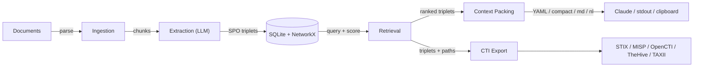

# Knowledge Graph Context Pipeline (KGCP)

Ingest documents, extract SPO triplets via LLM, store in a persistent graph, and retrieve token-efficient structured context for Claude.

Extends Robert McDermott's [AI Knowledge Graph Generator (AIKG)](https://github.com/robert-mcdermott/ai-knowledge-graph) — which produces HTML visualizations — by closing the gap between knowledge extraction and LLM context injection. A 10K-token document might yield 2K tokens of structured facts as triplets.

Implements all four of John Lambert's [Algebras of Defense](https://www.microsoft.com/en-us/security/blog/2025/12/09/changing-the-physics-of-cyber-defense/) — relational tables, graphs, anomaly detection, and temporal analysis — fused into a unified scoring system.

## Architecture



Seven layers: Ingestion (multi-format parsing) — Extraction (SPO via LLM) — Storage (SQLite + NetworkX) — Retrieval (keyword + N-hop + unified scoring) — Packing (4 output formats) — Integration (Claude API + clipboard + file) — CTI Export (STIX 2.1 + platform adapters).

## Getting Started

### Prerequisites

- **Python 3.10+**
- **An OpenAI-compatible LLM endpoint** — [Ollama](https://ollama.com) is recommended for local use. After installing, pull a model and start the server:

```bash
ollama pull gemma3
ollama serve
```

### Install

Clone the repo and install in development mode:

```bash
git clone https://github.com/jeff-is-working/knowledge-graph-context-pipeline.git
cd knowledge-graph-context-pipeline
python3 -m venv .venv
source .venv/bin/activate
pip install -e ".[all,dev]"
```

The `[all]` extra installs PDF parsing (PyMuPDF), Claude integration (anthropic), and precise token counting (tiktoken). The `[dev]` extra adds pytest.

### Configure

KGCP works out of the box with Ollama's default endpoint. To customize, copy `config.toml` to `~/.kgcp/config.toml` or set environment variables:

```bash
export KGCP_LLM_URL="http://localhost:11434/v1/chat/completions"
export KGCP_MODEL="gemma3:12b"
export KGCP_DB_PATH="~/.kgcp/knowledge.db"
```

### Verify

Run the test suite (does not require an LLM endpoint):

```bash
.venv/bin/python -m pytest tests/ -v
```

## CLI Reference

Ingest documents and query the graph. The `--unified` flag activates cross-algebra scoring, and `paths` reconstructs temporally-ordered attack chains from a seed entity.

```bash
kgcp ingest report.txt
kgcp ingest ./threat-intel/ --recursive
kgcp query "APT28 targets" --budget 2048 --format compact
kgcp query "APT28" --unified --min-anomaly 0.3
kgcp paths apt28 --format timeline
kgcp paths apt28 --since 90d --format json
```

Baselines snapshot the graph so anomaly detection can identify new or unusual relationships after subsequent ingestions.

```bash
kgcp baseline create --label "pre-ingestion"
kgcp anomalies --min-score 0.3 --format table
kgcp anomalies --entity apt28
```

Time-scoped queries and trend detection track how relationships evolve. Dates support ISO format, quarter notation (`2025-Q1`), and relative shorthand (`90d`, `6m`).

```bash
kgcp query "APT28" --since 2025-Q1 --until 2025-Q2
kgcp trends --entity apt28 --window 30 --format table
kgcp stats --communities --anomalies
```

### CTI Export

Export the knowledge graph to CTI platforms. STIX 2.1 is the base format; MISP, OpenCTI, and TheHive adapters convert to platform-native structures. A read-only TAXII 2.1 server provides pull-based distribution.

```bash
kgcp export-cti stix --entity APT28 -o bundle.json
kgcp export-cti misp --entity APT28 --push
kgcp export-cti opencti --entity APT28 --push
kgcp export-cti thehive --entity APT28 --push
kgcp export-cti attack-map --entity APT28
kgcp serve-taxii --host 0.0.0.0 --port 9500
```

Install CTI extras: `pip install -e ".[cti-platforms,taxii]"`. For full configuration and data mapping details, see [docs/CTI_INTEGRATION.md](docs/CTI_INTEGRATION.md).

For the full CLI reference with all options, see [docs/ARCHITECTURE.md](docs/ARCHITECTURE.md#cli-command-reference).

## Output Formats

YAML is the default because it achieves 34-38% fewer tokens than JSON for equivalent information:

```yaml
# 47 triplets, 1823 tokens, from 3 sources
entities:
  apt28: {type: threat_actor, centrality: 0.82}
facts:
  - [apt28, targets, energy sector]
  - [apt28, uses, credential harvesting]
provenance:
  - source: "Russia-APT28-targeting.txt"
```

Compact arrow notation for maximum density:

```
apt28 -> targets -> energy sector [since:2025-01-15, x3] [score:0.87]
```

Markdown tables and natural language prose are also available via `--format markdown` and `--format nl`.

## Documentation

| Document | Purpose |
|----------|---------|
| [docs/](docs/README.md) | Documentation index |
| [docs/ARCHITECTURE.md](docs/ARCHITECTURE.md) | System design, data model, design decisions |
| [docs/DEVELOPER_GUIDE.md](docs/DEVELOPER_GUIDE.md) | Dev setup, coding conventions, testing |
| [docs/DEPLOYMENT.md](docs/DEPLOYMENT.md) | Configuration, operations, troubleshooting |
| [docs/SECURITY.md](docs/SECURITY.md) | Threat model, data protection, security controls |
| [docs/SBOM.md](docs/SBOM.md) | Dependency inventory, license compliance, vulnerability scanning |
| [docs/CTI_INTEGRATION.md](docs/CTI_INTEGRATION.md) | STIX 2.1, MISP, OpenCTI, TheHive, TAXII — config, mapping, usage |
| [DESIGN.md](DESIGN.md) | Phase-by-phase implementation history |

## License

MIT
