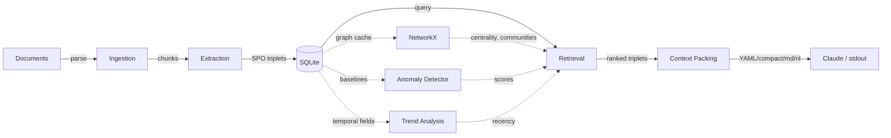

# Architecture

KGCP is a six-layer pipeline that converts unstructured documents into token-efficient structured context for LLMs. It implements all four of John Lambert's "Algebras of Defense" — relational tables, graphs, anomaly detection, and temporal analysis — fused into a unified scoring system.

## System Overview

## Layer Descriptions

**Ingestion** (`kgcp/ingestion/`) parses documents into text chunks. The parser registry supports plaintext, Markdown, HTML, PDF (via PyMuPDF), and source code files. Paragraph-aware chunking splits text into overlapping word-level windows (default 100 words, 20-word overlap).

**Extraction** (`kgcp/extraction/`) sends each chunk to an OpenAI-compatible LLM endpoint (Ollama recommended) with a system prompt that requests Subject-Predicate-Object triplets as JSON. Responses are parsed with fault-tolerant JSON extraction that handles code blocks, trailing commas, and truncated arrays. Extracted triplets are normalized (lowercase, deduplication), scored for confidence via predicate-specificity heuristics, and standardized to merge equivalent entities.

**Storage** (`kgcp/storage/`) persists triplets, documents, entities, baselines, and anomaly scores in SQLite with WAL mode and foreign key enforcement. An in-memory NetworkX directed graph (`GraphCache`) mirrors the triplet store for fast traversal, centrality computation, and Louvain community detection.

**Retrieval** (`kgcp/retrieval/`) combines keyword search with N-hop graph expansion from seed entities. Retrieved subgraphs can be scored via the cross-algebra unified scorer, which fuses extraction confidence, graph centrality, anomaly score, and temporal recency into a single weighted relevance score.

**Context Packing** (`kgcp/packing/`) serializes ranked triplets into one of four output formats within a token budget. YAML is the default because research shows it achieves 34-38% fewer tokens than JSON for equivalent information.

**Integration** (`kgcp/integration/`) delivers packed context to stdout, clipboard, file, or directly to Claude via the Anthropic SDK.

## Data Model

The core dataclasses live in `kgcp/models.py`. The central entity is `Triplet`, which carries provenance, confidence, temporal metadata, and an extensible metadata dict.

| Dataclass | Key Fields | Purpose |
|-----------|-----------|---------|
| `Triplet` | subject, predicate, object, confidence, first_seen, last_seen, observation_count, metadata | Core knowledge unit |
| `DocumentChunk` | content, doc_id, chunk_index | Text segment fed to LLM |
| `Document` | source_path, doc_id, ingested_at | Tracked source file |
| `Entity` | name, entity_type, first_seen, doc_ids | Named entity in the graph |
| `Baseline` | community_partition, centrality_scores, predicate_histogram, edge_set | Graph fingerprint snapshot |
| `AnomalyResult` | triplet_id, score, signals | Per-triplet anomaly assessment |
| `ScoredTriplet` | triplet, unified_score, components | Cross-algebra scored wrapper |
| `AttackPath` | seed_entity, steps, entities_involved, time_span, total_anomaly | Temporally-ordered attack chain |
| `PackedContext` | content, format, token_count, triplet_count, sources | Serialized output |

## Data Flow

A typical query flows through these steps:

1. **Keyword search** finds seed triplets matching the query text in SQLite
2. **N-hop expansion** traverses the NetworkX graph from seed entities to collect related triplets
3. **Relevance scoring** boosts confidence for triplets containing query terms
4. **Anomaly attachment** (optional) looks up per-triplet anomaly scores from the latest baseline
5. **Temporal filtering** (optional) excludes triplets outside the since/until window
6. **Unified scoring** (optional) computes a weighted fusion of confidence, centrality, anomaly, and recency
7. **Packing** serializes the top-ranked triplets into the chosen format within the token budget

## CLI Command Reference

All commands are registered via Click under the `kgcp` entry point defined in `pyproject.toml`.

| Command | Purpose | Key Options |
|---------|---------|-------------|
| `kgcp ingest <path>` | Parse and extract triplets from documents | `--recursive`, `--source-label` |
| `kgcp query <text>` | Retrieve and pack relevant context | `--budget`, `--format`, `--hops`, `--anomalies`, `--since/--until`, `--unified`, `--min-anomaly`, `--to-clipboard`, `--to-file` |
| `kgcp paths <entity>` | Reconstruct temporally-ordered attack paths | `--hops`, `--since/--until`, `--min-anomaly`, `--limit`, `--format`, `--to-file` |
| `kgcp stats` | Show graph statistics | `--communities`, `--anomalies` |
| `kgcp export` | Export full graph | `--format`, `--output` |
| `kgcp baseline create` | Snapshot current graph as baseline | `--label` |
| `kgcp baseline list` | List all saved baselines | |
| `kgcp baseline show [ID]` | Show baseline details | |
| `kgcp baseline delete <ID>` | Remove a baseline and its scores | |
| `kgcp anomalies` | Score and surface anomalous relationships | `--since`, `--min-score`, `--limit`, `--entity`, `--format` |
| `kgcp trends` | Detect frequency trends in relationships | `--entity`, `--window`, `--since/--until`, `--format`, `--limit` |

## Design Decisions

| Decision | Rationale |
|----------|-----------|
| YAML as default output format | Best accuracy-to-token ratio across LLMs (34-38% fewer tokens than JSON) |
| SQLite + NetworkX over Neo4j | Zero external dependencies for a CLI tool; graph protocol interface allows future swap |
| OpenAI-compatible LLM API | Works with Ollama, vLLM, OpenAI, or any compatible endpoint without code changes |
| Heuristic confidence scoring | Predicate specificity and entity-type heuristics avoid extra LLM calls |
| Five-signal anomaly detection | Purely structural (no ML model needed): new entity, new edge, community mismatch, unusual predicate, centrality drift |
| Linear recency decay | Simple, interpretable temporal scoring without requiring time-series infrastructure |
| Configurable fusion weights | Users can tune the balance between confidence, centrality, anomaly, and recency for their domain |

## Lambert's Four Algebras

KGCP implements all four of John Lambert's "Algebras of Defense" from his 2025 framework on changing the physics of cyber defense. For the full implementation history across Phases 6-8, see [DESIGN.md](../DESIGN.md).

| Algebra | KGCP Implementation |
|---------|-------------------|
| Relational Tables | SQLite with indexed triplets, entities, documents, chunks, baselines, anomaly scores |
| Graphs | NetworkX graph cache with N-hop traversal, degree centrality, Louvain community detection |
| Anomalies | Baseline fingerprinting, 5-signal scoring, entity drift detection |
| Vectors Over Time | Temporal fields on triplets, upsert tracking, trend detection, time-scoped queries |
| **Cross-Algebra Fusion** | Unified scorer combining all four into weighted relevance; attack path reconstruction |
