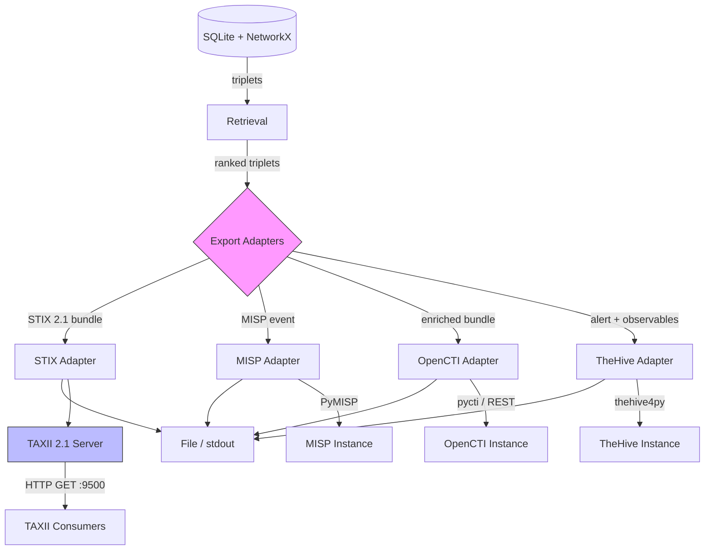

# CTI Platform Integration

KGCP exports its knowledge graph to five CTI formats and platforms. The export layer sits on top of the retrieval layer — it takes the same triplets and attack paths you query via `kgcp query` and `kgcp paths`, converts them to platform-native structures, and optionally pushes them to a remote instance.

## Architecture and Adapter Pipeline



All adapters register via `register_exporter(name, class)` in `kgcp/export/__init__.py`, mirroring the packing module's format registry. Every adapter inherits from `BaseExporter` and implements two core methods:

| Method | Input | Output |
|--------|-------|--------|
| `export_triplets(triplets, entities)` | List of `Triplet` objects | Platform-native dict |
| `export_attack_path(path)` | `AttackPath` object | Platform-native dict |

Additional methods: `push(data)` sends to a remote platform, `to_file(data, path)` writes JSON. The programmatic API works the same way across all adapters:

```python
from kgcp.export import get_exporter, list_exporters

exporter = get_exporter("stix", config)
bundle = exporter.export_triplets(triplets)
```

All entity names are sanitized before export — control characters, ANSI escapes, and excessive length (>512 chars) are stripped. Error responses from remote platforms are truncated to 1000 characters with escape sequences removed.

## STIX 2.1 Adapter

The core adapter — all other adapters build on or compose with it.

### Entity Type Mapping

KGCP entity types map to STIX 2.1 SDO types:

| KGCP Type | STIX SDO Type | Notes |
|-----------|---------------|-------|
| `threat_actor` | `threat-actor` | |
| `malware` | `malware` | `is_family: true` |
| `vulnerability` | `vulnerability` | |
| `tool` | `tool` | |
| `technique` | `attack-pattern` | |
| `organization` | `identity` | `identity_class: organization` |
| `location` | `location` | |
| `unknown` | `identity` | Fallback |

### Predicate Mapping

KGCP predicates map to STIX Relationship types, with some reversals:

| Predicate | STIX Relationship | Reversed? |
|-----------|-------------------|-----------|
| `targets` | `targets` | No |
| `uses` | `uses` | No |
| `exploits` | `exploits` | No |
| `develops` | `authored-by` | Yes (subject/object swap) |
| `authored_by` | `authored-by` | No |
| `mitigates` | `mitigates` | No |
| `indicates` | `indicates` | No |
| `attributed_to` | `attributed-to` | No |
| `located_in` | `located-at` | No |
| `variant_of` | `variant-of` | No |

Unmapped predicates pass through as custom relationship types.

### Deterministic IDs

STIX object IDs are deterministic via UUIDv5, keyed on `(sdo_type, entity_name, entity_type)`. This means re-exporting the same data produces identical IDs — critical for deduplication in downstream platforms.

### Custom Properties

Each STIX relationship object includes:
- `x_kgcp_triplet_id` — links back to the source triplet
- `x_kgcp_predicate` — original KGCP predicate (before mapping)
- `x_kgcp_observation_count` — included when > 1

### CLI Usage

```bash
# Export full graph as STIX bundle
kgcp export-cti stix -o bundle.json

# Export triplets related to a specific entity
kgcp export-cti stix --entity APT28 -o apt28.json

# Export with ATT&CK technique mapping
kgcp export-cti attack-map --entity APT28
```

## MITRE ATT&CK Mapping

The `AttackMapper` (`kgcp/export/attack_mapper.py`) matches triplets to MITRE ATT&CK techniques via keyword overlap. It downloads and caches the Enterprise ATT&CK STIX bundle to `~/.kgcp/enterprise-attack.json`.

### How Matching Works

1. Each ATT&CK technique's name and first sentence of description are tokenized into keywords (stopwords removed)
2. Triplet text (subject + predicate + object) is tokenized the same way
3. Jaccard similarity between keyword sets produces a match confidence
4. Direct name matches get a bonus
5. Entity type `technique` gets an additional bonus

Results are sorted by confidence and capped at `max_results` per triplet.

### CLI

```bash
# Show ATT&CK matches for an entity's subgraph
kgcp export-cti attack-map --entity APT28

# Update cached ATT&CK data
kgcp export-cti attack-map --entity APT28 --update
```

## MISP Adapter

Exports triplets as MISP events with attributes, tags, and ATT&CK technique annotations.

### Data Mapping

| KGCP Concept | MISP Structure |
|---|---|
| Query result / attack path | Event |
| Entity | Attribute (typed by entity_type) |
| Confidence | `estimative-language:confidence-in-analytic-judgment` tag |
| Anomaly score | `threat_level_id` (1=high, 2=medium, 3=low, 4=undefined) |
| ATT&CK match | `mitre-attack:attack-pattern` tag |

### Entity Type to MISP Attribute

| KGCP Type | MISP Attribute Type | MISP Category |
|-----------|-------------------|---------------|
| `threat_actor` | `threat-actor` | Attribution |
| `malware` | `malware-type` | Payload delivery |
| `vulnerability` | `vulnerability` | External analysis |
| `tool` | `text` | Payload delivery |
| `organization` | `target-org` | Targeting data |
| `location` | `text` | Targeting data |
| `technique` | `text` | External analysis |

### CLI Usage

```bash
# Export as MISP event JSON
kgcp export-cti misp --entity APT28 -o event.json

# Export with custom event info
kgcp export-cti misp --query "phishing" --event-info "Phishing Campaign Q1"

# Push directly to MISP instance
kgcp export-cti misp --entity APT28 --push
```

### Configuration

```toml
[cti.misp]
url = "https://misp.example.com"
api_key = "your-api-key"
verify_ssl = true
timeout = 120
default_distribution = 0    # 0=org, 1=community, 2=connected, 3=all
default_threat_level = 2    # 1=high, 2=medium, 3=low, 4=undefined
default_analysis = 0        # 0=initial, 1=ongoing, 2=complete
publish_on_push = false
```

Environment variables: `KGCP_MISP_URL`, `KGCP_MISP_API_KEY`

## OpenCTI Adapter

Composes the STIX adapter, then enriches with OpenCTI-specific extensions. Push supports both pycti (preferred) and REST/GraphQL fallback.

### OpenCTI Extensions

- `x_opencti_score` added to all SDOs (non-relationship objects)
- Score derived from STIX `confidence` field, or defaults to 50

### Push Strategy

1. **pycti** (preferred) — uses `OpenCTIApiClient.stix2.import_bundle()`
2. **REST/GraphQL** (fallback) — posts to `/graphql` with `stixBundleAdd` mutation

### CLI Usage

```bash
# Export as OpenCTI-enriched STIX bundle
kgcp export-cti opencti --entity APT28 -o bundle.json

# Push to OpenCTI instance
kgcp export-cti opencti --entity APT28 --push
```

### Configuration

```toml
[cti.opencti]
url = "https://opencti.example.com"
api_key = "your-api-key"
verify_ssl = true
```

Environment variables: `KGCP_OPENCTI_URL`, `KGCP_OPENCTI_API_KEY`

## TheHive Adapter

Exports triplets as TheHive alerts with observables, anomaly-based severity, and natural language descriptions.

### Data Mapping

| KGCP Concept | TheHive Structure |
|---|---|
| Query result / attack path | Alert |
| Entity | Observable (dataType: `other`, typed via tags) |
| Anomaly score | Severity (1=low, 2=medium, 3=high, 4=critical) |
| Triplet relationships | Observable message (top 5 relationships) |

### Anomaly to Severity

| Anomaly Score | TheHive Severity |
|---|---|
| >= 0.8 | 4 (Critical) |
| >= 0.6 | 3 (High) |
| >= 0.3 | 2 (Medium) |
| < 0.3 | 1 (Low) |

### CLI Usage

```bash
# Export as TheHive alert JSON
kgcp export-cti thehive --entity APT28 -o alert.json

# Push alert to TheHive instance
kgcp export-cti thehive --entity APT28 --push
```

### Configuration

```toml
[cti.thehive]
url = "https://thehive.example.com"
api_key = "your-api-key"
verify_ssl = true
timeout = 120
default_severity = 2    # 1=low, 2=medium, 3=high, 4=critical
default_tlp = 2         # 0=white, 1=green, 2=amber, 3=red
```

Environment variables: `KGCP_THEHIVE_URL`, `KGCP_THEHIVE_API_KEY`

## TAXII 2.1 Server

A read-only TAXII 2.1 server that serves STIX bundles from the live KGCP graph. External CTI consumers can pull data via the standard TAXII protocol.

### Endpoints

| Method | Path | Description |
|--------|------|-------------|
| GET | `/taxii2/` | Discovery — server info and API roots |
| GET | `/api/` | API Root — version and capabilities |
| GET | `/api/collections/` | List available collections |
| GET | `/api/collections/{id}/` | Collection detail |
| GET | `/api/collections/{id}/objects/` | Get STIX objects from collection |
| GET | `/api/collections/{id}/manifest/` | Object manifest |

### Query Parameters

The objects endpoint supports filtering:
- `added_after` — ISO timestamp, returns only triplets with `first_seen` after this date
- `limit` — maximum number of triplets to include (1-10000)

### Authentication

API key authentication via the `Authorization` header. Accepts both `Bearer <key>` and raw key formats. If no API key is configured, the server runs open (no auth required).

### CLI Usage

```bash
# Start TAXII server with defaults (127.0.0.1:9500)
kgcp serve-taxii

# Custom bind address
kgcp serve-taxii --host 0.0.0.0 --port 8443
```

### Client Example

```bash
# Discovery
curl -H "Authorization: Bearer your-key" http://localhost:9500/taxii2/

# Get STIX objects
curl -H "Authorization: Bearer your-key" \
  "http://localhost:9500/api/collections/kgcp-all-triplets/objects/"

# Filter by date
curl -H "Authorization: Bearer your-key" \
  "http://localhost:9500/api/collections/kgcp-all-triplets/objects/?added_after=2025-06-01T00:00:00Z"
```

### Configuration

```toml
[cti.taxii]
api_key = "your-taxii-api-key"
title = "KGCP TAXII 2.1 Server"
host = "127.0.0.1"
port = 9500
max_content_length = 10000000
```

Environment variable: `KGCP_TAXII_API_KEY`

## Installation and Usage

The CTI module has tiered optional dependencies. All platform SDKs are lazy-imported — you only need them if you use `--push` or `serve-taxii`.

| Extra | Install Command | Packages | Purpose |
|-------|----------------|----------|---------|
| `cti` | `pip install -e ".[cti]"` | `stix2>=3.0.0` | STIX 2.1 bundle generation |
| `cti-platforms` | `pip install -e ".[cti-platforms]"` | `pymisp`, `pycti`, `thehive4py` | Push to MISP/OpenCTI/TheHive |
| `taxii` | `pip install -e ".[taxii]"` | `fastapi`, `uvicorn`, `httpx` | TAXII 2.1 server |

The export module lives in `kgcp/export/` (8 files: registry, base class, entity type map, ATT&CK mapper, and 4 platform adapters) and the TAXII server in `kgcp/server/taxii.py`.

A complete end-to-end workflow from ingestion to CTI platform delivery:

```bash
kgcp ingest ~/reports/apt28-campaign.pdf          # 1. Ingest
kgcp baseline create --label "post-apt28-ingest"   # 2. Baseline
kgcp ingest ~/reports/apt28-update.pdf             # 3. Ingest update
kgcp anomalies --entity apt28 --min-score 0.3      # 4. Detect anomalies
kgcp paths apt28 --format timeline                 # 5. Reconstruct attack path
kgcp export-cti stix --entity APT28 -o bundle.json # 6a. Export STIX
kgcp export-cti misp --entity APT28 --push         # 6b. Push to MISP
kgcp export-cti opencti --entity APT28 --push      # 6c. Push to OpenCTI
kgcp export-cti thehive --entity APT28 --push      # 6d. Push to TheHive
kgcp serve-taxii --host 0.0.0.0 --port 9500        # 7. Start TAXII server
```
