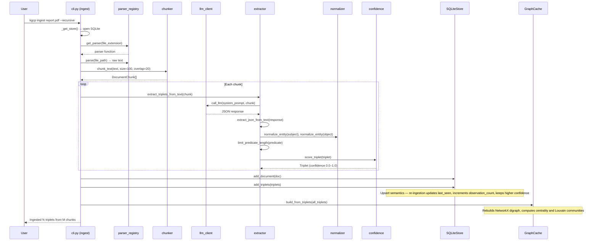
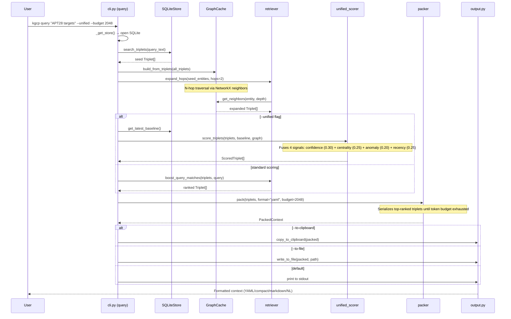
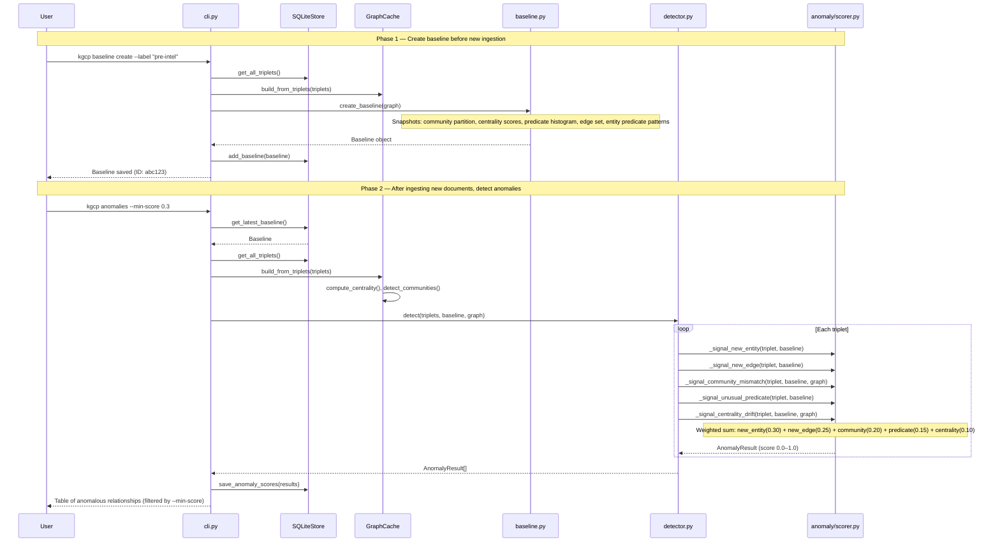
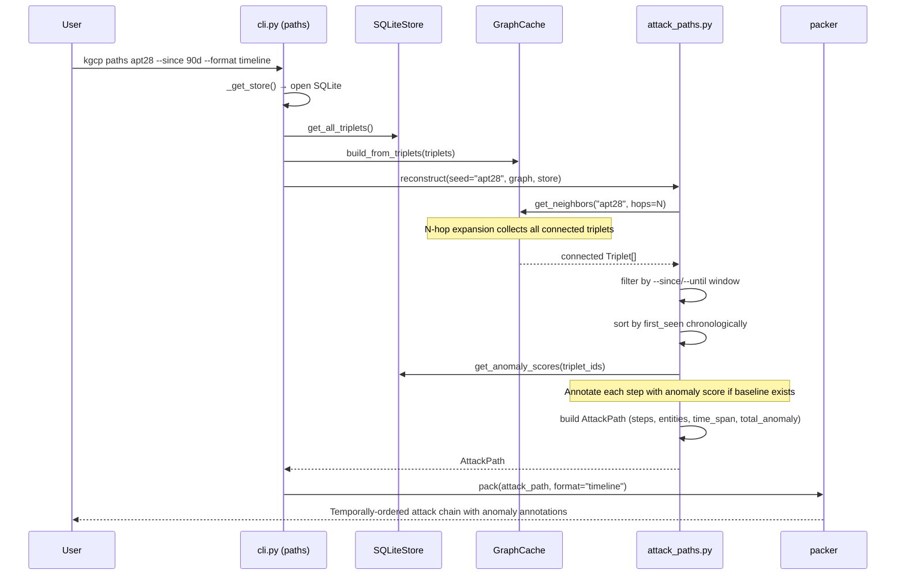
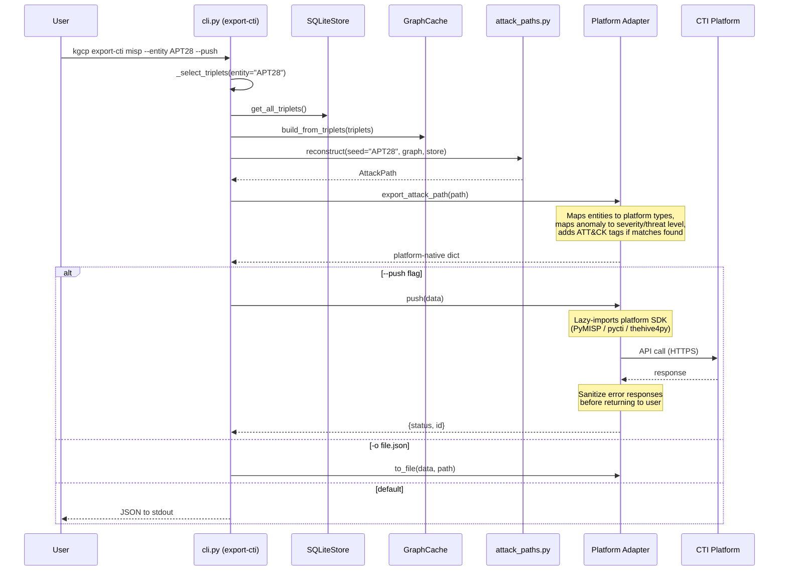

# Data Flow

This document traces how data moves through KGCP's seven layers. Each flow is drawn from the verified execution paths in the codebase: CLI entry point → helper functions → storage/computation → output. For the layer descriptions and design decisions behind these flows, see [Architecture](ARCHITECTURE.md). For CTI-specific data mappings and platform configuration, see [CTI Integration](CTI_INTEGRATION.md).

## Document Ingestion

When a user runs `kgcp ingest`, the pipeline parses files into text chunks, sends each chunk to an LLM for Subject-Predicate-Object extraction, normalizes and scores the resulting triplets, and persists them to SQLite with an in-memory graph mirror.



## Query and Context Retrieval

The query flow finds relevant triplets via keyword search, expands the result set through graph traversal, optionally applies cross-algebra scoring, and packs the ranked results into the chosen output format within a token budget.



## Anomaly Detection

Anomaly detection compares the current graph state against a saved baseline fingerprint. The scorer evaluates five structural signals per triplet — no LLM calls required. This flow spans two user actions: creating a baseline, then later scoring against it.



## Attack Path Reconstruction

The `paths` command reconstructs temporally-ordered attack chains from a seed entity. It combines graph traversal with chronological sorting and anomaly annotation to show how an attacker's operations unfolded over time.



## CTI Export

The `export-cti` commands select triplets from the store (by entity, query, or full graph), convert them to a platform-native format via the appropriate adapter, and either write to a file or push to a remote CTI platform. This flow covers MISP, OpenCTI, and TheHive — the STIX adapter is the base that all others compose or build upon.



## TAXII 2.1 Server

The `serve-taxii` command starts a FastAPI server that serves STIX bundles from the live KGCP graph. External consumers poll the TAXII endpoints to pull STIX objects. Each request builds a fresh bundle from the current triplet store.

```mermaid
sequenceDiagram
    participant Client as TAXII Consumer
    participant Server as FastAPI (taxii.py)
    participant Auth as verify_api_key
    participant Store as SQLiteStore
    participant STIX as STIXExporter

    Client->>Server: GET /taxii2/ (Authorization: Bearer key)
    Server->>Auth: validate API key
    Auth-->>Server: OK
    Server-->>Client: Discovery (API roots, title)

    Client->>Server: GET /api/collections/kgcp-all-triplets/objects/?added_after=2025-06-01
    Server->>Auth: validate API key
    Server->>Store: get_all_triplets()
    Store-->>Server: Triplet[]
    Server->>Server: filter by added_after
    Server->>STIX: export_triplets(filtered)
    Note over STIX: Generates deterministic STIX 2.1<br/>bundle with SDOs + SROs
    STIX-->>Server: STIX bundle dict
    Server-->>Client: application/stix+json;version=2.1
```

## Data Lifecycle

All persistent state lives in a single SQLite file. This table summarizes what is stored and how it changes over time.

| Data | Created By | Updated By | Deleted By |
|------|-----------|-----------|-----------|
| Documents | `kgcp ingest` | Re-ingestion (updates ingested_at) | Not exposed via CLI |
| Chunks | `kgcp ingest` | Re-ingestion (replaced) | Not exposed via CLI |
| Triplets | `kgcp ingest` | Re-ingestion (upsert: last_seen, observation_count, max confidence) | Not exposed via CLI |
| Entities | `kgcp ingest` | Re-ingestion (adds doc_ids) | Not exposed via CLI |
| Baselines | `kgcp baseline create` | Immutable after creation | `kgcp baseline delete <ID>` |
| Anomaly scores | `kgcp anomalies` | Re-scored on each `kgcp anomalies` run | Cascade-deleted with baseline |
