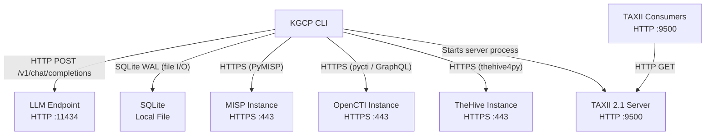

# Infrastructure Setup Guide

KGCP is a local CLI tool with minimal infrastructure requirements. At its simplest, it needs only an OpenAI-compatible LLM endpoint and a local filesystem. Optional components -- CTI platform connections and a TAXII 2.1 server -- add network requirements but no additional infrastructure to host. This guide covers how to deploy and maintain each component. For installation steps, see [README Getting Started](../README.md#getting-started). For configuration reference, see [DEPLOYMENT.md](DEPLOYMENT.md).

## Network Architecture

KGCP's components communicate over a small set of well-defined connections. The core pipeline runs entirely on localhost; network access is only required when pushing to remote CTI platforms or exposing the TAXII server.



The following table summarizes network requirements by deployment scenario.

| Scenario | Outbound | Inbound | Ports |
|----------|----------|---------|-------|
| Local-only (Ollama + SQLite) | None | None | 11434 (localhost only) |
| Remote LLM API (OpenAI, etc.) | HTTPS to API provider | None | 443 outbound |
| CTI platform push | HTTPS to each platform | None | 443 outbound per platform |
| TAXII server (localhost) | None | None | 9500 (localhost only) |
| TAXII server (network-exposed) | None | TCP from consumers | 9500 (or custom) inbound |

**Firewall considerations**: For local-only use, no firewall changes are needed. If exposing the TAXII server to a network, open only the specific port (default 9500) and restrict source IPs to known consumers. CTI platform push requires outbound HTTPS -- ensure your firewall allows egress to each platform's hostname on port 443.

## LLM Endpoint Deployment

KGCP's extraction layer sends document chunks to any OpenAI-compatible chat completions endpoint and parses structured triplets from the response. The endpoint choice affects extraction quality, speed, and cost. All configuration details are in [DEPLOYMENT.md](DEPLOYMENT.md#llm-endpoint-configuration).

### Ollama (Recommended)

Ollama is the recommended backend for local use -- it serves open-weight models with no cloud costs and runs on macOS, Linux, and Windows.

Install and start Ollama, then pull a model:

```bash
# Install Ollama (macOS/Linux)
curl -fsSL https://ollama.com/install.sh | sh

# Pull the recommended model
ollama pull gemma3:12b

# Verify the server is running
curl -s http://localhost:11434/v1/models | python3 -m json.tool
```

Ollama serves on port 11434 by default. KGCP's default `base_url` points there, so no additional configuration is needed after pulling a model. If Ollama runs on a different host or port, set `KGCP_LLM_URL` accordingly.

GPU acceleration significantly improves extraction throughput. Ollama automatically uses available GPUs on supported systems. Verify GPU detection with `ollama ps` while a model is loaded.

### Model Recommendations

Model selection balances extraction quality against resource requirements. KGCP's structured extraction prompt works best with instruction-tuned models of 7B parameters or more.

| Model | Parameters | Extraction Quality | Speed (tokens/s, M1 Pro) | VRAM Required |
|-------|-----------|-------------------|--------------------------|---------------|
| `gemma3:12b` | 12B | Good -- recommended default | ~25 | 8 GB |
| `llama3.1:8b` | 8B | Good | ~35 | 6 GB |
| `mistral:7b` | 7B | Adequate | ~40 | 5 GB |
| `gemma3:27b` | 27B | Very good | ~12 | 18 GB |
| `llama3.1:70b` | 70B | Excellent | ~3 | 40 GB |
| `qwen2.5:14b` | 14B | Good | ~20 | 10 GB |

Models below 7B parameters tend to produce malformed JSON or miss relationships. Models above 27B produce higher-quality extractions but require significant GPU memory or run very slowly on CPU.

### vLLM (High Throughput)

vLLM is worth deploying when you have multiple GPUs or need to process large document batches with high concurrency. It provides OpenAI-compatible endpoints out of the box.

```bash
# Install vLLM
pip install vllm

# Start serving (example with 2 GPUs)
vllm serve meta-llama/Llama-3.1-8B-Instruct \
  --tensor-parallel-size 2 \
  --port 8000
```

Point KGCP at the vLLM endpoint:

```bash
export KGCP_LLM_URL="http://localhost:8000/v1/chat/completions"
export KGCP_MODEL="meta-llama/Llama-3.1-8B-Instruct"
```

### Remote APIs

Commercial API endpoints (OpenAI, Anthropic via proxy, Groq, Together) eliminate local GPU requirements but introduce per-token costs and latency. Configure them by setting the endpoint URL and API key:

```bash
export KGCP_LLM_URL="https://api.openai.com/v1/chat/completions"
export KGCP_MODEL="gpt-4o-mini"
export KGCP_API_KEY="sk-..."
```

Cost estimation: a 10-page PDF produces roughly 50-100 chunks. At ~500 input tokens and ~200 output tokens per chunk, expect 25K-50K input tokens and 10K-20K output tokens per document. Budget accordingly for your API provider's pricing.

### Health Checking

Verify the LLM endpoint is reachable before running extraction:

```bash
# Check Ollama health
curl -s http://localhost:11434/v1/models | python3 -c "import sys,json; d=json.load(sys.stdin); print(f'{len(d.get(\"data\",[]))} models available')"

# Test a chat completion (works with any OpenAI-compatible endpoint)
curl -s http://localhost:11434/v1/chat/completions \
  -H "Content-Type: application/json" \
  -d '{"model":"gemma3:12b","messages":[{"role":"user","content":"ping"}],"max_tokens":5}' \
  | python3 -c "import sys,json; print(json.load(sys.stdin)['choices'][0]['message']['content'])"
```

### Performance Tuning

KGCP's default LLM parameters are tuned for structured extraction. Adjust them in `config.toml` or via environment variables if needed.

| Parameter | Default | Purpose | Tuning Notes |
|-----------|---------|---------|-------------|
| `temperature` | 0.8 | Controls response randomness | Lower (0.3-0.5) for more consistent extractions; higher for creative entity discovery |
| `max_tokens` | 8192 | Maximum response length | Increase if extraction is truncated (look for incomplete JSON arrays) |
| `timeout` | 120s | HTTP request timeout | Increase for slow endpoints or very large chunks; decrease for fast local models |

## Database Infrastructure

KGCP stores all triplets, entities, documents, baselines, and anomaly scores in a single SQLite database. The schema auto-creates on first run -- no migration tooling is needed.

### Default Location and Configuration

The database lives at `~/.kgcp/knowledge.db` by default. Override it with the `KGCP_DB_PATH` environment variable or `[storage] db_path` in `config.toml`. KGCP creates the directory and file automatically on first use.

```bash
# Check current database location and size
ls -lh ~/.kgcp/knowledge.db

# Use a project-specific database
export KGCP_DB_PATH="~/projects/threat-intel/knowledge.db"
```

### Concurrency and Journaling

KGCP enables WAL (Write-Ahead Logging) journaling mode on every connection. WAL provides safe concurrent reads -- multiple `kgcp query` or `kgcp stats` invocations can run simultaneously. However, SQLite enforces a single-writer lock: only one process can write (ingest, baseline create) at a time. Concurrent write attempts will block until the lock is released or timeout.

### Storage Capacity Planning

Estimate disk usage based on your ingestion volume. Each triplet (including indexes and metadata) consumes approximately 500 bytes in the database.

| Ingestion Scale | Estimated Triplets | Database Size | Notes |
|----------------|-------------------|---------------|-------|
| 10 documents | 500-2,000 | 1-2 MB | Small project or proof of concept |
| 100 documents | 5,000-20,000 | 5-15 MB | Team knowledge base |
| 1,000 documents | 50,000-200,000 | 30-120 MB | Department-scale corpus |
| 10,000 documents | 500,000-2,000,000 | 300 MB-1.2 GB | Large corpus; consider Neo4j at >1M triplets |

The NetworkX in-memory graph cache adds roughly 200 bytes per triplet to RAM usage during query operations.

### Backup and Restore

SQLite's single-file architecture makes backups straightforward. Because KGCP uses WAL mode, file copies taken while KGCP is reading (but not writing) are safe. For guaranteed consistency, stop all KGCP processes first.

```bash
# Simple backup (safe during reads due to WAL)
cp ~/.kgcp/knowledge.db ~/.kgcp/knowledge.db.bak

# Timestamped backup
cp ~/.kgcp/knowledge.db ~/.kgcp/backups/knowledge-$(date +%Y%m%d-%H%M%S).db

# Restore: stop KGCP, replace the database, restart
cp ~/.kgcp/backups/knowledge-20260327-140000.db ~/.kgcp/knowledge.db
```

### Disk Space Monitoring

Monitor the database file and WAL file sizes. The WAL file (`knowledge.db-wal`) can grow during long write operations and is checkpointed automatically by SQLite.

```bash
# Check database and WAL sizes
ls -lh ~/.kgcp/knowledge.db*

# Check triplet count
kgcp stats
```

## CTI Platform Connectivity

KGCP can push extracted knowledge to MISP, OpenCTI, and TheHive. Each connection requires a running platform instance, network access, and API credentials. For platform-specific data mapping and configuration reference, see [CTI_INTEGRATION.md](CTI_INTEGRATION.md). For credential handling best practices, see [SECURITY.md](SECURITY.md).

### Prerequisites

Each platform requires its SDK to be installed and a configured instance to be reachable over HTTPS:

```bash
# Install platform SDKs
pip install -e ".[cti-platforms]"
```

| Platform | Required SDK | Instance Requirement | Config Section |
|----------|-------------|---------------------|----------------|
| MISP | `pymisp` | MISP 2.4+ with API enabled | `[cti.misp]` |
| OpenCTI | `pycti` | OpenCTI 5.x+ with GraphQL API | `[cti.opencti]` |
| TheHive | `thehive4py` | TheHive 4.x+ or 5.x | `[cti.thehive]` |

### Credential Management

Platform API keys must be provided via environment variables -- never commit them to config files tracked in version control. See [SECURITY.md](SECURITY.md#data-protection) for the full credential handling policy.

```bash
# Set credentials via environment variables
export KGCP_MISP_URL="https://misp.example.com"
export KGCP_MISP_API_KEY="your-misp-authkey"

export KGCP_OPENCTI_URL="https://opencti.example.com"
export KGCP_OPENCTI_API_KEY="your-opencti-token"

export KGCP_THEHIVE_URL="https://thehive.example.com"
export KGCP_THEHIVE_API_KEY="your-thehive-api-key"
```

### Connection Testing

Verify connectivity to each platform before your first push operation. This catches URL typos, expired keys, and network issues early.

```bash
# Test MISP connectivity
curl -sk -H "Authorization: ${KGCP_MISP_API_KEY}" \
  "${KGCP_MISP_URL}/servers/getPyMISPVersion.json"

# Test OpenCTI connectivity
curl -sk -H "Authorization: Bearer ${KGCP_OPENCTI_API_KEY}" \
  -H "Content-Type: application/json" \
  -d '{"query":"{ about { version } }"}' \
  "${KGCP_OPENCTI_URL}/graphql"

# Test TheHive connectivity
curl -sk -H "Authorization: Bearer ${KGCP_THEHIVE_API_KEY}" \
  "${KGCP_THEHIVE_URL}/api/status"
```

### SSL/TLS Considerations

All CTI platform connections use HTTPS by default. For self-signed certificates (common in lab environments), disable SSL verification per platform:

```toml
[cti.misp]
verify_ssl = false

[cti.opencti]
verify_ssl = false

[cti.thehive]
verify_ssl = false
```

Disabling SSL verification is acceptable for isolated lab networks but should not be used in production. For production deployments with internal CAs, add your CA certificate to the system trust store instead.

### Timeout Configuration

All CTI push operations timeout after 120 seconds by default. Configure per-platform timeouts for slow or high-latency connections:

```toml
[cti.misp]
timeout = 180

[cti.thehive]
timeout = 180
```

## TAXII Server Deployment

KGCP includes a read-only TAXII 2.1 server that serves STIX bundles from the live knowledge graph. External CTI consumers (SIEMs, TIPs, SOARs) can pull data via the standard TAXII protocol. For endpoint reference and data format details, see [CTI_INTEGRATION.md](CTI_INTEGRATION.md#taxii-21-server).

### Basic Local Deployment

The TAXII server requires the `taxii` extras and starts with a single command:

```bash
# Install TAXII dependencies
pip install -e ".[taxii]"

# Start on localhost (default 127.0.0.1:9500)
kgcp serve-taxii
```

By default, the server binds to `127.0.0.1` -- accessible only from the local machine. This is the correct default for development and testing.

### Production Deployment

For network-accessible deployments, configure a bind address, port, and API key. Always set an API key before binding to a non-localhost address.

```bash
# Set the API key
export KGCP_TAXII_API_KEY="a-strong-random-key"

# Bind to all interfaces on a custom port
kgcp serve-taxii --host 0.0.0.0 --port 9500
```

Equivalent `config.toml` configuration:

```toml
[cti.taxii]
api_key = "a-strong-random-key"
host = "0.0.0.0"
port = 9500
max_content_length = 10000000  # 10 MB max response
```

### Reverse Proxy with TLS Termination

For production use, terminate TLS at a reverse proxy rather than in KGCP directly. The following nginx configuration proxies HTTPS traffic to the local TAXII server:

```nginx
server {
    listen 443 ssl;
    server_name taxii.example.com;

    ssl_certificate     /etc/ssl/certs/taxii.example.com.pem;
    ssl_certificate_key /etc/ssl/private/taxii.example.com.key;

    location / {
        proxy_pass http://127.0.0.1:9500;
        proxy_set_header Host $host;
        proxy_set_header X-Real-IP $remote_addr;
        proxy_set_header X-Forwarded-For $proxy_add_x_forwarded_for;
        proxy_set_header X-Forwarded-Proto $scheme;
    }
}
```

With this setup, KGCP binds only to localhost while clients connect over TLS on port 443.

### Monitoring

Monitor the TAXII server with periodic health checks:

```bash
# Health check (discovery endpoint)
curl -s -o /dev/null -w "%{http_code}" \
  -H "Authorization: Bearer ${KGCP_TAXII_API_KEY}" \
  http://localhost:9500/taxii2/

# Check object count in the collection
curl -s -H "Authorization: Bearer ${KGCP_TAXII_API_KEY}" \
  http://localhost:9500/api/collections/kgcp-all-triplets/manifest/ \
  | python3 -c "import sys,json; d=json.load(sys.stdin); print(f'{len(d.get(\"objects\",[]))} objects')"
```

## Backup and Recovery

KGCP's state is concentrated in a small number of files. A complete backup captures these files; recovery is a file replacement operation. For operational procedures including baseline lifecycle, see [DEPLOYMENT.md](DEPLOYMENT.md#operations). For security implications of backup data, see [SECURITY.md](SECURITY.md#data-protection).

### What to Back Up

| File | Location | Contains | Critical? |
|------|----------|----------|-----------|
| `knowledge.db` | `~/.kgcp/knowledge.db` | All triplets, entities, baselines, anomaly scores | Yes |
| `config.toml` | `~/.kgcp/config.toml` or `./config.toml` | LLM and pipeline configuration | Yes (if customized) |
| `enterprise-attack.json` | `~/.kgcp/enterprise-attack.json` | Cached ATT&CK data | No (auto-downloads) |

Do not back up the WAL file (`knowledge.db-wal`) or shared-memory file (`knowledge.db-shm`) separately -- they are transient and will be recreated by SQLite.

### Backup Frequency

Match backup frequency to your ingestion cadence:

| Ingestion Frequency | Backup Frequency | Rationale |
|--------------------|-----------------|-----------|
| Ad-hoc (occasional documents) | Before and after each ingestion batch | Low volume; manual backups sufficient |
| Daily batch ingestion | Daily | Automated backup before each batch |
| Continuous / high-volume | Every 6-12 hours | Limits data loss window |

### Automated Backup Script

The following cron job creates timestamped backups and retains the last 30 days:

```bash
#!/bin/bash
# Save as ~/.kgcp/backup.sh and chmod +x
BACKUP_DIR="$HOME/.kgcp/backups"
DB_PATH="$HOME/.kgcp/knowledge.db"
mkdir -p "$BACKUP_DIR"

# Copy the database (safe during reads due to WAL)
cp "$DB_PATH" "$BACKUP_DIR/knowledge-$(date +%Y%m%d-%H%M%S).db"

# Remove backups older than 30 days
find "$BACKUP_DIR" -name "knowledge-*.db" -mtime +30 -delete
```

Add to crontab for daily execution:

```bash
# Run backup daily at 2:00 AM
0 2 * * * /bin/bash ~/.kgcp/backup.sh
```

### Recovery Procedure

Recovery replaces the database file. Stop any running KGCP processes first to avoid WAL conflicts.

```bash
# 1. Stop any running KGCP processes (TAXII server, active ingestions)
pkill -f "kgcp serve-taxii" 2>/dev/null

# 2. Replace the database with the backup
cp ~/.kgcp/backups/knowledge-20260327-020000.db ~/.kgcp/knowledge.db

# 3. Verify integrity
kgcp stats

# 4. Restart the TAXII server if it was running
kgcp serve-taxii &
```

**Point-in-time recovery limitations**: SQLite does not support WAL archiving or log shipping. Recovery restores to the exact state of the backup file. Any triplets ingested after the backup was taken are lost. For critical pipelines, increase backup frequency or export important subgraphs to CTI platforms as a secondary copy.

## Capacity Planning and Monitoring

KGCP's resource consumption scales with the number of stored triplets and the extraction workload. This section provides sizing guidance and monitoring approaches. For operational administration, see [ADMIN_GUIDE.md](ADMIN_GUIDE.md).

### Resource Requirements

| Component | CPU | Memory | Disk | Notes |
|-----------|-----|--------|------|-------|
| KGCP CLI (ingestion) | 1 core | 256 MB base | Minimal | CPU usage dominated by LLM wait time |
| LLM endpoint (Ollama) | 2-8 cores | Model-dependent (5-40 GB) | 4-40 GB per model | GPU strongly recommended |
| SQLite database | Negligible | Proportional to query size | 500 bytes/triplet | WAL adds ~1x DB size temporarily |
| NetworkX graph cache | Negligible | ~200 bytes/triplet | None (in-memory) | Loaded on first query per session |
| TAXII server | 1 core | 128 MB base | None (reads from DB) | Memory scales with concurrent requests |

### Scaling Characteristics

KGCP's three main operations have different bottlenecks:

| Operation | Bottleneck | Scaling Lever |
|-----------|-----------|---------------|
| Extraction (ingestion) | LLM inference speed | Faster GPU, larger model parallelism (vLLM), or remote API |
| Storage (write) | SQLite single-writer lock | Batch ingestion; consider Neo4j above 1M triplets |
| Retrieval (query) | NetworkX graph traversal, memory for graph cache | Sufficient RAM for full graph in memory |

### Monitoring

Use these commands to monitor KGCP's health and growth:

```bash
# Graph statistics: triplet count, entity count, community structure
kgcp stats
kgcp stats --communities

# Database file size
du -h ~/.kgcp/knowledge.db

# LLM endpoint health
curl -s http://localhost:11434/v1/models | python3 -m json.tool

# TAXII server health (if running)
curl -s -o /dev/null -w "%{http_code}" http://localhost:9500/taxii2/
```

### Growth Estimation

Document processing produces triplets at roughly these ratios, though actual yields depend on document density and model quality:

| Stage | Ratio | Example (100-page report) |
|-------|-------|--------------------------|
| Pages to chunks | ~5-10 chunks per page | 500-1,000 chunks |
| Chunks to triplets | ~3-8 triplets per chunk | 1,500-8,000 triplets |
| Triplets to disk | ~500 bytes per triplet | 0.75-4.0 MB |

### When to Consider Migration

SQLite with NetworkX handles most KGCP workloads well. Consider migrating to a dedicated graph database (Neo4j) when:

- Triplet count exceeds 1 million (graph cache exceeds ~200 MB RAM)
- Concurrent write access is required (multiple ingestion pipelines)
- Complex graph queries (beyond N-hop traversal) become frequent
- You need built-in graph visualization or Cypher query support

KGCP does not currently include a Neo4j storage backend, so this would be a custom development effort. The storage layer's interface (`kgcp/storage/`) is designed to be swappable -- a Neo4j adapter would implement the same methods as the SQLite store.
